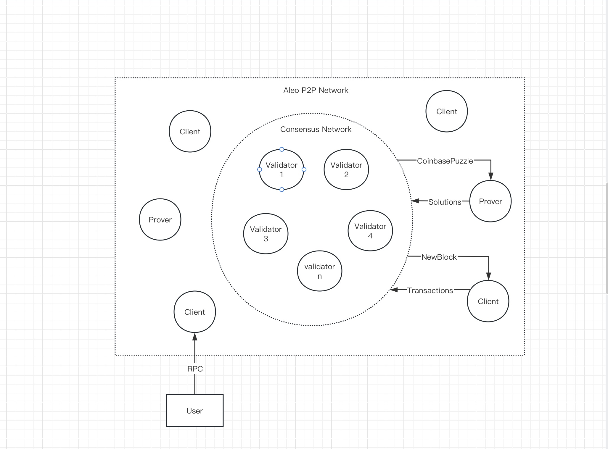

在 Aleo 区块链生态系统中，网络架构包含两个不同的组件：共识网络和对等网络（P2P）。在此框架内，存在三种基本节点类型：验证者（Validators）、证明者（Provers）和客户端（Clients）。

### 验证者（Validator）

[**验证者**](./validators.md) 是共识网络和 P2P 网络的重要组成部分。他们通常在共识网络端口 5000 和 P2P 网络端口 4130 上运行。验证者通过端口 5000 相互连接，以建立统一的共识网络。值得注意的是，客户端和证明者**被禁止**访问共识网络。

验证者节点的主要职责是遵守 AleoBFT 规则以促进新区块的生成。

在 Aleo P2P 网络中，客户端和证明者通过 P2P 机制相互连接。此外，他们与预定的一组验证者建立连接，以从共识网络获取最新的区块。

### 客户端（Client）

[**客户端**](./client.md) 在生态系统中扮演着关键角色，通过同步共识网络生成的区块并相应地更新账本。通过客户端的 RPC，用户可以访问 Aleo 网络的实时账本状态，并将交易广播到网络。交易包含在新区块中意味着它们在网络中成功执行。

### 证明者（Prover）

[**证明者**](./provers.md) 节点承担同步共识网络生成的 CoinbasePuzzles 的责任。它们执行必要的算法来生成满足特定标准的解决方案。随后，证明者将这些解决方案广播到 P2P 网络，以传输到共识网络。一旦共识网络将这些解决方案集成到新区块中，证明者就有权获得相应的 CoinbaseReward 激励。
