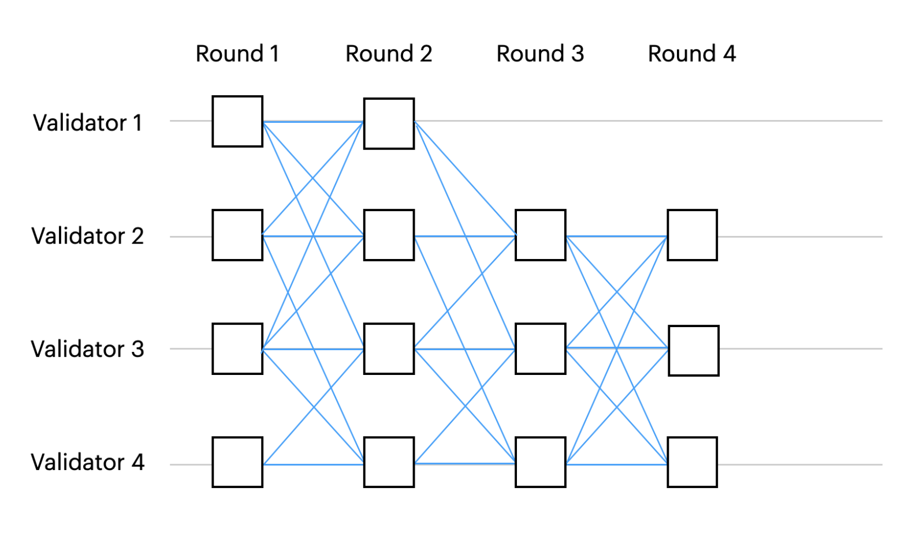
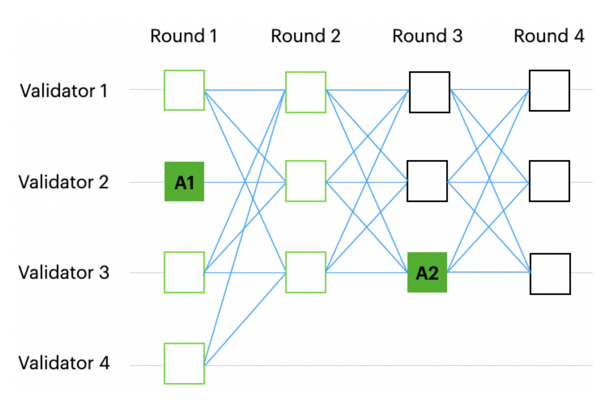
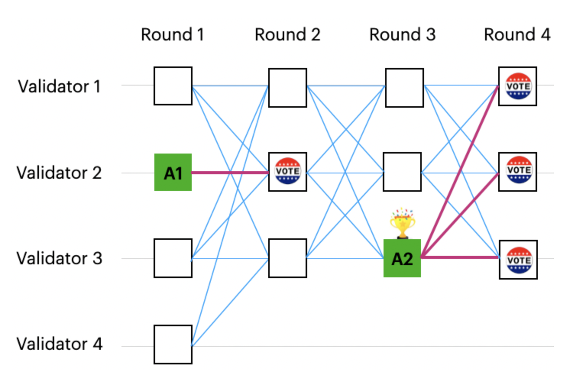
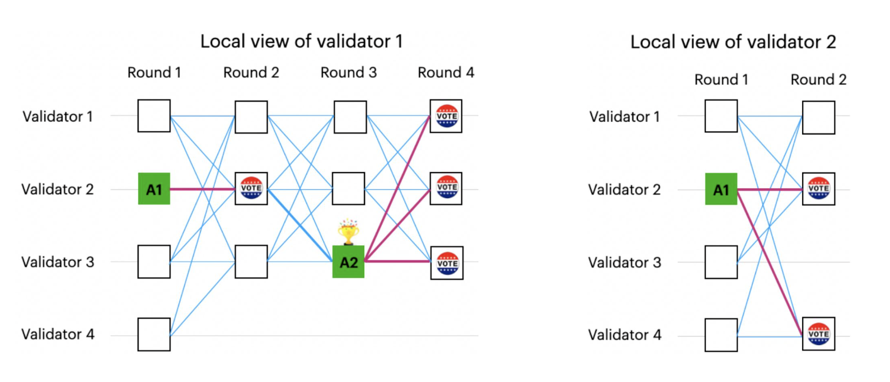
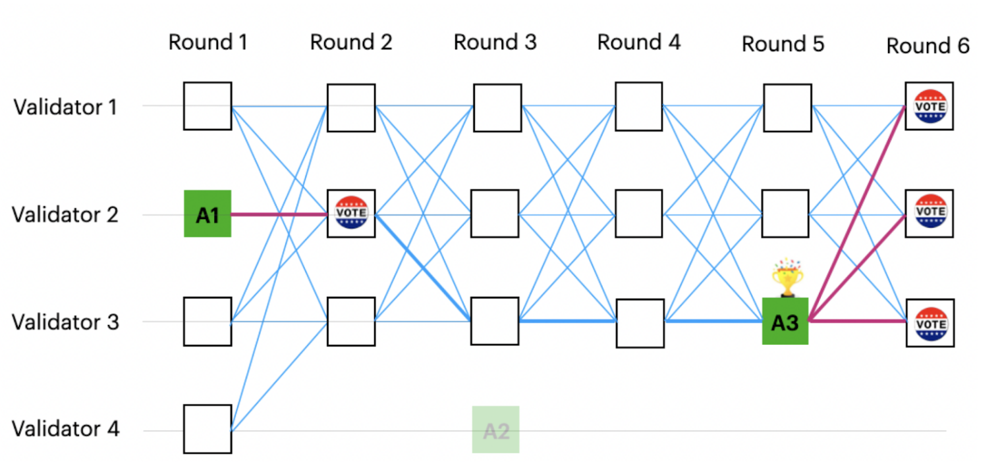
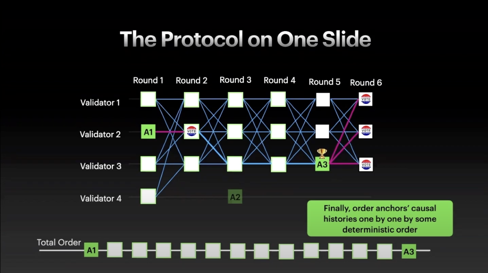
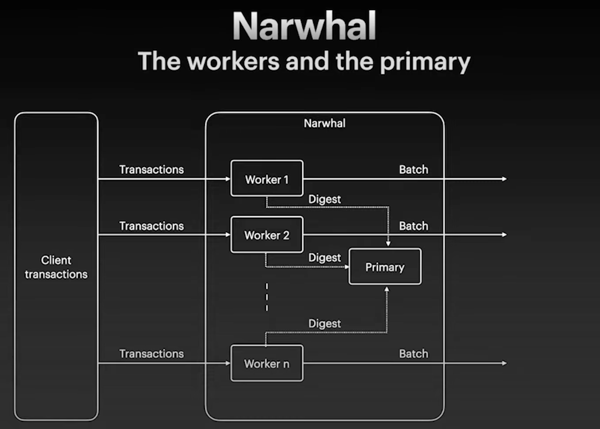
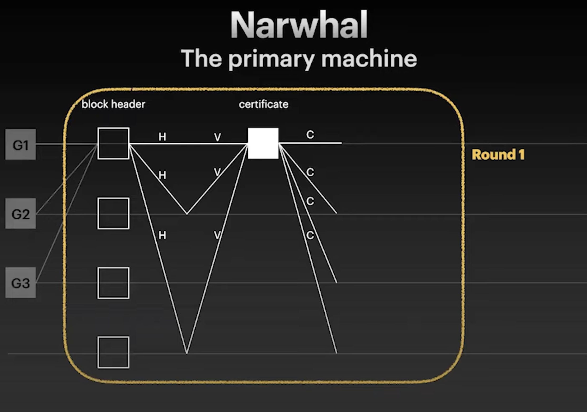
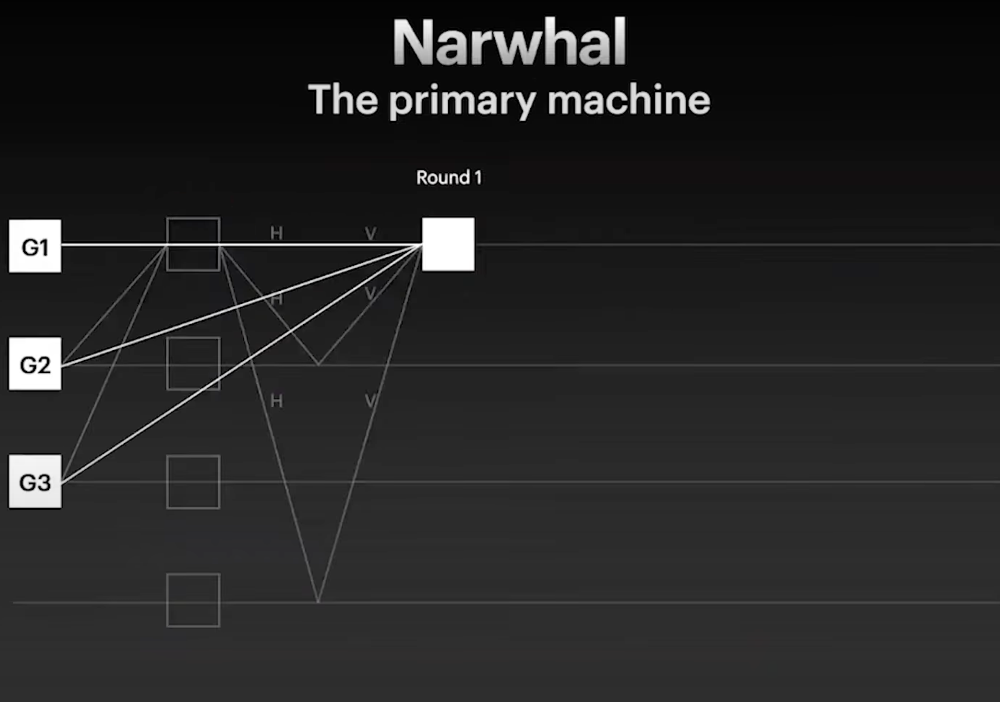

## 概述
Aleo Network 采用一种独特的共识机制，称为 [AleoBFT](../specifications.md#aleobft)，以实现安全且具有即时终局性的共识系统，用于区块确认。该机制结合了权益证明（POS），确保验证者因维护系统整体完整性和性能而获得奖励。

Aleo Network 由三组参与者运行和维护：  
- **质押者（Stakers）** - 委托质押 Aleo Credits (AC) 以帮助引入更多验证者并参与网络共识。  
- **证明者（Provers）** - 使用专业硬件生成证明并解决 coinbase 难题，为网络安全做出贡献。  
- **验证者（Validators）** - 通过验证零知识（ZK）证明来验证交易，并积极参与网络共识过程。

有关上述群体的更多信息，请查看此 [FAQs](https://aleo.org/faq/)。

任何人都可以通过锁定 Aleo Credits 一定时间来支持 Aleo Network 的安全性，从而成为质押者。虽然最低质押金额为 1 AC，但质押者只有在质押至少 10 个 AC 时才能开始获得奖励。质押者通过将他们的权益委托给他们选择的验证者，帮助降低成为验证者的门槛。  

更多关于**质押者**的信息，请参见 [这里](./staking.md)。  

证明者需要运行专业的 GPU 和 CPU 来生成 SNARK 证明中的 PoSW（Proof-of-Succinct-Work）coinbase 难题的解决方案。他们根据生成难题解决方案的效率和有效性获得奖励。需要注意的是，证明者不产生区块，但他们被激励去改进证明生成过程，降低成本，并减少程序执行的延迟。  

更多关于**证明者**的信息，请参见 [这里](./provers.md)。  

验证者通过 AleoBFT（将在下文进一步讨论）保障网络安全，并且必须至少质押 1000 万 AC 才能开始。验证者的主要功能是在将交易包含在已确认的区块之前验证 ZK 证明并验证交易。

更多关于**验证者**的信息，请参见 [这里](./validators.md)。  

## AleoBFT
AleoBFT 是一种新的混合共识架构。它是一种基于 DAG 的 BFT 协议，受到 Narwhal 和 Bullshark 的启发。它激励验证者保持网络活性，并激励证明者为 Aleo 生态系统扩展证明能力。

一旦验证者对每个区块达成共识，AleoBFT 就能保证即时终局性。有了即时终局性，不仅验证者享受更好的节点稳定性，也为应用开发者和用户创造流畅的体验。而且这种保证使与其他生态系统的互操作性变得更加简单。

AleoBFT 证明者是 ZK 证明的核心计算组件，通过解决和生成这些 coinbase 证明获得 coinbase 奖励的一部分，这被称为简洁工作证明（PoSW）。这激励证明者也通过积累和质押 1000 万 AC 成为验证者。通过更广泛的奖励分配，它帮助 Aleo Network 实现更大的证明能力，进一步去中心化和扩展 Aleo 网络，并加强抗审查保证。

:::info
有关 AleoBFT 的详细技术规格，请参考 [AleoBFT 规范](https://developer.aleo.org/specs/aleobft.pdf)。
:::

## Bullshark 和 Narwhal

### Bullshark
Bullshark 是一种基于 DAG（有向无环图）的 BFT（拜占庭容错）协议，它将网络通信层与排序（共识）逻辑分开。每条消息包含一组交易，以及对前一条消息的引用集合。所有消息一起形成一个不断增长的 DAG——消息是顶点，其引用是边。顶点可以是提案，边可以是投票。

由于网络的异步特性，不同方在任何时间点可能会看到略有不同的 DAG，但每个验证者仍然可以通过查看其本地视图中的 DAG 来对所有顶点（区块）进行完全排序，而无需发送任何额外消息。

这里使用的是基于轮次的 DAG，每个顶点与轮次号相关联，每轮最多有 `n` 个顶点。每轮每个验证者广播一条消息，每条消息至少引用前一轮的 `n − f` 条消息。`n` 是网络中验证节点的总数，`f` 是拜占庭节点的数量。下面显示了 `n = 4` 和 `f = 1` 时的示例图。

图 1：基于轮次的 DAG  
图片来源：https://decentralizedthoughts.github.io/2022-06-28-DAG-meets-BFT/

### 排序逻辑
每个偶数轮选举出一个预定义的领导者，与其关联的顶点被称为锚点（Anchor）。锚点是这里更合适的术语，因为在典型的基于领导者的协议中，领导者必须在每一轮做所有工作并向所有其他节点传播数据，而这里的锚点只在收集到足够多的投票（`2f + 1`，本例中为 3）时才被选择提交其因果关系历史。

每个奇数轮的顶点可以为前一轮的锚点贡献一票。如果锚点至少有 `f + 1`（本例中为 2）票，则锚点被提交。一旦锚点被提交，其因果关系历史将通过某种确定性规则进行排序。图 2 中绿色边框的顶点是锚点 2（A2）的因果关系历史。图 3 显示 A2 获得 3 票被提交，但 A1 也仅获得 1 票被提交，这是由于 DAG 的可靠性属性，即诚实广播的交易最终会被所有其他诚实验证者接收。

图 2：锚点和因果关系历史  
图片来源：https://decentralizedthoughts.github.io/2022-06-28-DAG-meets-BFT/

图 3：提交规则  
图片来源：https://decentralizedthoughts.github.io/2022-06-28-DAG-meets-BFT/

由于网络的异步特性，不同方的 DAG 本地视图可能有所不同。A1 可能已经被其他验证者提交。如图 4 所示，验证者 2 看到锚点 A1 有 `f + 1`（2）票，因此即使验证者 1 没有，它也提交了 A1。

图 4：不同的本地视图  
图片来源：https://decentralizedthoughts.github.io/2022-06-28-DAG-meets-BFT/

因为提交一个锚点需要 `f + 1`（本例中为 2）票，并且 DAG 中的每个顶点至少有 `n − f`（本例中为 3）条边连接到前一轮的顶点，所以可以保证，如果某个方提交了锚点 A，那么所有更高轮次的锚点都将有一条路径指向至少一个为 A 投票的顶点，从而有一条路径指向 A。

这也意味着如果没有路径从未来的锚点指向锚点 A，那么没有方提交了 A，因此可以安全地跳过它。图 5 显示 A2 没有被任何方提交，因此 A2 可以安全地跳过。

图 5：跳过未提交的锚点  
图片来源：https://decentralizedthoughts.github.io/2022-06-28-DAG-meets-BFT/

当一个锚点被提交时，验证者检查是否有通往先前未提交锚点的路径。如果有，它也会提交先前的锚点。此过程重复进行，直到到达先前已提交的锚点。图 5 显示 A3 被提交，A1 在 A3 的路径中，因此 A1 也被提交。

然后通过某种确定性顺序对锚点历史进行排序，最终形成完全有序或区块链。

图 6：完全有序  
图片来源：https://www.youtube.com/watch?v=aW1-XcGzJ8M

### Narwhal
Narwhal 是一种基于 DAG 的内存池抽象协议。不是由提案验证者将区块中的所有交易发送给其他验证者，他们只是在每轮发送区块可用性的引用或证书。

单个验证者将运行多个作为单独进程或实例的工作器和一个主验证器。工作器负责接收交易并将交易批量流式传输到其他验证者的相应工作器。例如，验证者 1 的工作器 1 将交易发送到验证者 2 的工作器 1，验证者 1 的工作器 2 将交易发送到验证者 2 的工作器 2，依此类推。

图 7：Narwhal 设计  
图片来源：https://www.youtube.com/watch?v=NGOXVSFzYdI

每个验证者内的所有工作器将其批量的哈希（摘要）发送到其主验证器。然后主验证器将摘要连同前一轮的 `n - f` 个证书一起发送给所有其他验证者。  

每个验证者然后检查摘要是否来自同一轮，以及其工作器是否存储了与摘要对应的交易批量。如果是，验证者通过将其签名发送回发送主验证者来投票。  

发送者在收集来自不同验证者的 `n - f` 个签名后创建一个证书，然后将此证书发送回所有其他验证者。然后在下一轮中使用此证书作为引用。

每当收到证书时，意味着区块将可供下载。因此，证书通常被称为可用性证明，从而确保数据可用性。

图 8：Narwhal 的一轮  
图片来源：https://www.youtube.com/watch?v=NGOXVSFzYdI

图 9：一轮的另一个视图  
图片来源：https://www.youtube.com/watch?v=NGOXVSFzYdI
