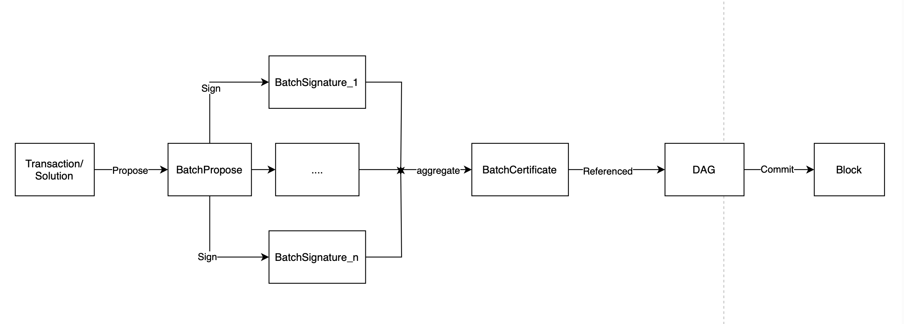
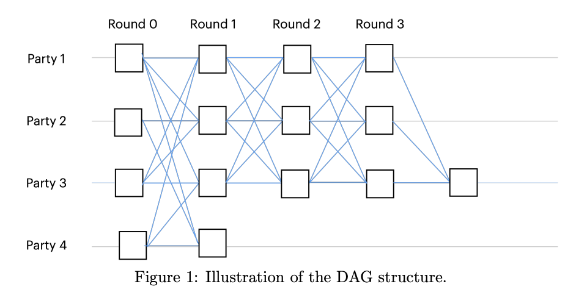

### 网络中验证者节点的角色和功能

Aleo 网络中的验证者节点形成共识网络，并通过 Aleo 拜占庭容错（[AleoBFT](./consensus.md)）共识协议确定区块生成。验证者通过质押 `AleoCredits` 获得投票权，节点的投票权与其质押的 `AleoCredits` 数量成正比。AleoBFT 确保当生成新区块时，它获得超过 2/3 投票的批准，表明诚实的验证者之间达成了共识。这有效地确保了网络安全并防止恶意节点的攻击。一旦区块形成，它就实现了 `finalized`，这意味着区块及其包含的交易不会被撤销。

### 验证者节点的经济激励

AleoBFT 的机制确保如果恶意节点试图攻击网络，它需要获得至少 1/3 的投票权才能阻止新区块的产生。这意味着网络中质押的 `AleoCredits` 越多，共识网络就越安全。为了激励验证者节点质押其 `AleoCredits`，每个产生的区块都包含相应的 `BlockReward` 给验证者节点。验证者节点获得的 `BlockReward` 比例与其质押的 `AleoCredits` 比例一致。

### 成为验证者节点

要成为验证者节点，需要质押至少 10,000,000（1000 万）`AleoCredits`。一旦质押交易被共识网络接受，新的验证者节点可以立即参与共识并获得 `BlockReward` 激励，这要归功于 AleoBFT 对 Narwhal Bullshark 的改进。

当一个人只拥有少量 `AleoCredits` 时，虽然无法成为独立的验证者节点，但可以通过委托参与质押。

由于网络中的验证者节点相互通信以获取状态信息，验证者节点越多，所需的网络通信量就越大，通信复杂度为 `O(n)`。通信复杂度的增加导致更长的区块生成时间。在 Aleo 网络中，验证者节点的最大数量限制为 200，以平衡去中心化和网络效率。

### 委托质押

委托质押允许用户通过程序（Aleo 的智能合约）在特定验证者节点上质押 `AleoCredits`。从质押 `AleoCredits` 获得的投票权也委托给相应的验证者节点。用户按其质押比例获得 `BlockReward` 激励，而验证者可能会收取程序中设置的一定百分比的费用。各种钱包和浏览器为用户提供委托质押的功能。用户可以在 UI 界面上查看各种验证者的费用百分比，从而简化质押过程。

用户可以随时取消质押。取消后，用户可以在 360 个区块后将取消退回的 `AleoCredits` 提取到其余额中。

### 验证者如何确认交易/解决方案

验证者节点确认交易和解决方案的过程涉及以下步骤：

- 交易/解决方案通过 P2P 网络或 RPC 进入验证者节点的内存池。
- 验证者节点从内存池中选择一些交易/解决方案，并将它们包含在 `BatchPropose` 中（除了交易和解决方案外，`BatchPropose` 需要包含前一轮的 `2f + 1` 个 `BatchCertificates`），并将其广播给其他验证者节点。
- 收到 `BatchPropose` 后，其他验证者节点验证其合法性，对 `BatchPropose` 签名以生成 `BatchSignature`，并将 `BatchSignature` 返回给发起验证者节点。
- 当发起验证者节点收到超过 `2f + 1` 个 `BatchSignatures` 时，它将它们聚合为 `BatchCertificate` 并广播给其他验证者节点。
- 所有节点执行并重复此过程，形成由 `BatchCertificates` 组成的 DAG。当 DAG 被提交时，将产生新区块，交易和解决方案将包含在新区块中。

要更快地引导您的验证者节点，请参阅[账本快照](../../guides/node-operators/snapshots.md)指南。
