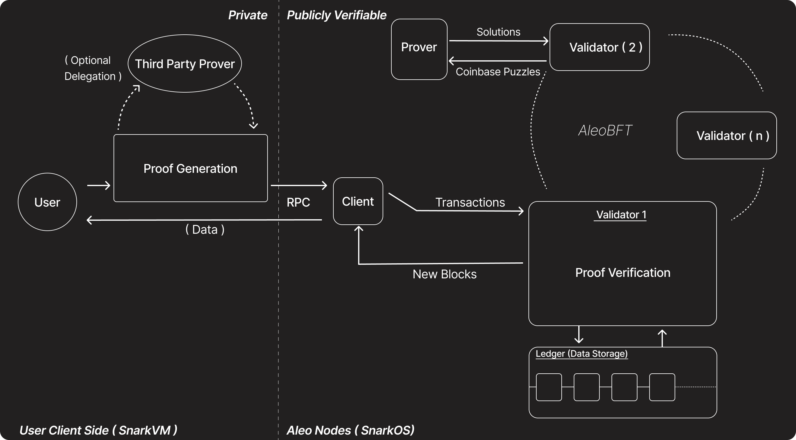

# 核心架构

Aleo 专注于无需许可的隐私编程，这意味着任何人都可以将任何逻辑编码到 Aleo 区块链上而无需获得任何人许可。这是通过两个关键组件实现的：

1. **SnarkVM（AleoVM）**：链下执行环境，作为 Aleo 的虚拟机。SnarkVM 本质上是 AleoVM，它允许执行 Aleo 程序和生成零知识证明。通过利用 SnarkVM 和加密，任何人都可以以隐私保护的方式执行逻辑。

2. **SnarkOS**：Aleo 的区块链节点客户端，由 AleoBFT 共识机制提供支持。SnarkOS 实现 AleoBFT 协议，确保网络参与者之间的安全高效共识。

这两个组件共同形成一个互补的系统，其中 SnarkVM 处理链下零知识证明执行，而 SnarkOS 作为网络客户端，通过验证提交的零知识证明（zk-SNARKs）来验证这些链下计算的正确性。

这种架构实现了两个关键能力：
- **对于用户**：通过链下计算和零知识证明，在与 Aleo 上的去中心化应用程序（程序）交互时保持数据隐私的能力
- **对于开发者**：使用 Leo 编程语言或 Aleo 指令创建隐私保护的去中心化应用程序并将其部署到网络的能力

## 是什么让 Aleo 具备无需许可性、隐私性和可编程性？

此图中的所有这些组件共同促成了无需许可的可编程隐私。

## 组件

### 用户（User）
**用户**通过准备输入和为其操作生成零知识证明（ZKP）来发起私密交易。用户可以在本地生成这些证明，或者委托给**第三方证明者**以提高效率。

### 证明生成
这是用户（或第三方）为交易计算零知识证明的过程。证明生成可以：
- **由用户本地**使用他们自己的设备完成。
- **委托给第三方证明者**（如钱包提供商），他们可以代表用户处理计算工作量。这种委托是可选的，并且不会损害用户数据的隐私性，因为授权/签名与证明是分开的。

### 第三方证明者
**第三方证明者**是用户可以可选地委托证明生成的外部服务。此实体从用户接收必要的数据，生成证明，然后将其返回给用户以进行提交。这提高了效率，特别是对于计算资源有限的用户。

### 客户端（Client）
**客户端**充当用户与 Aleo 网络之间的接口。它从用户接收证明和交易数据（通过 RPC），并将交易提交到网络。客户端还从网络接收新的区块和数据，将相关信息中继回给用户。

### 证明者（矿工）
**证明者**（有时称为"矿工"）是生成 coinbase 难题 SNARK 证明的网络参与者。他们的主要角色是提高证明生成的效率，这可以带来更快的交易确认时间和更好的用户体验。证明者不参与共识过程；相反，他们贡献计算资源来帮助解决密码学难题，将解决方案提交给验证者，**并因此获得 coinbase 奖励**。

### 验证者（Validators）
**验证者**负责验证提交的零知识证明的正确性，并使用 AleoBFT 协议维护共识。他们的职责包括：
- **证明验证**：检查附加到交易的证明的有效性。
- **共识参与**：参与 AleoBFT（拜占庭容错协议）以就下一个区块达成一致。
- **账本存储**：将验证的交易记录到账本中，作为新区块的一部分。

### 账本（数据存储）
**账本**是区块链的数据存储层。它存储所有已验证的交易和区块，确保网络上所有活动的不可变和可公开验证的记录。

## 执行私密交易的用户流程

1. 用户准备输入。
2. 从节点获取程序。
3. 使用 snarkvm 本地执行获取的程序中的所需函数。
4. 将输出证明结果以及输入和输出广播到客户端节点。在私密执行的情况下，输入和输出都是加密的。
5. 验证者验证证明并达成共识。
6. 如果交易被验证，那么它将被存储在新区块中的账本中。
7. 现在交易完全完成。
