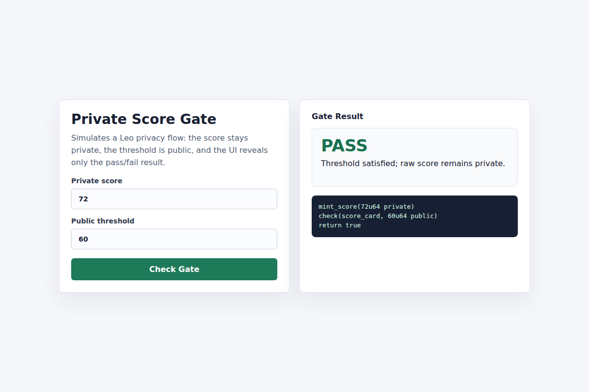

# Task 3 - Private Score Gate

## Project

Private Score Gate is a Leo + frontend privacy demo. A user owns a private score record, checks it against a public threshold, and only reveals whether the score passes the gate.

## Files

```text
learn/Risker-C/task3/
├── README.md
├── demo-screenshot.png
├── private_score_gate/
│   ├── program.json
│   ├── src/main.leo
│   └── tests/test_private_score_gate.leo
└── web/index.html
```

## Leo functions

- `mint_score(score)` creates a private `ScoreCard` record for the signer.
- `check(score_card, threshold)` verifies ownership and returns whether the private score is at least the public threshold.
- `bump(score_card, amount)` updates the private score while keeping the value inside a record.

## Local verification

```bash
leo test --path learn/Risker-C/task3/private_score_gate
```

Result:

```text
1 / 1 tests passed.
PASSED: test_private_score_gate.aleo/test_private_score_gate_flow
```

## Frontend demo

Open directly:

```bash
open learn/Risker-C/task3/web/index.html
```

Or run a local server:

```bash
cd learn/Risker-C/task3/web
python3 -m http.server 5173
```

## Demo screenshot


