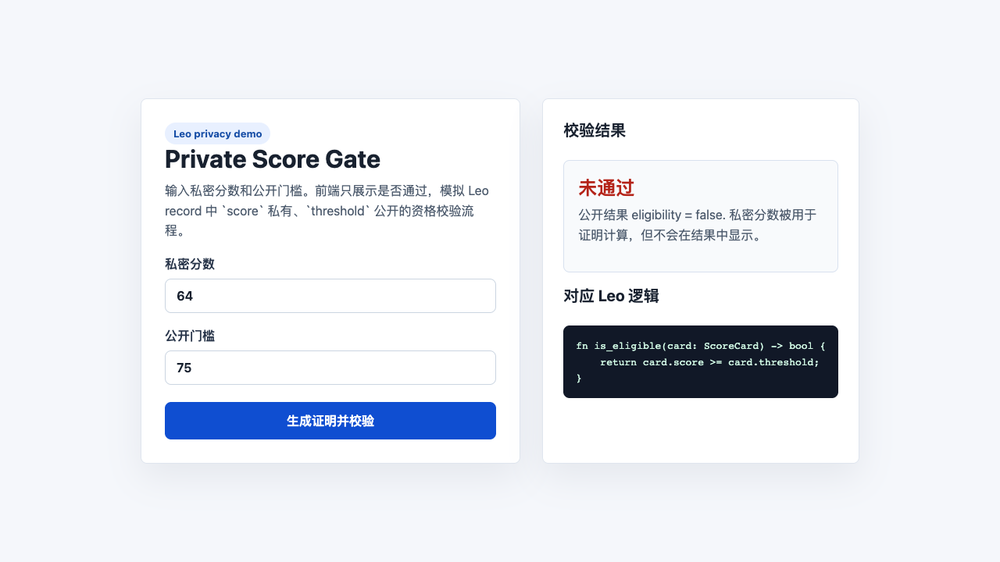

# Task 3 - Private Score Gate

## 项目简介

Private Score Gate 是一个基于 Leo 和前端的隐私资格校验小应用。用户输入自己的私密分数和公开门槛，前端只展示是否通过，不展示原始分数；Leo 程序用 private record 表达同样的隐私计算逻辑。

## 文件结构

```text
learn/liyincode/task3/
├── leo/
│   └── private_score_gate.leo
├── web/
│   └── index.html
├── demo-screenshot.png
└── task3.md
```

## 核心功能

- `mint_score_card`：为调用者生成包含私密分数的 record。
- `is_eligible`：消费 score card，只返回是否达到门槛。
- `transfer_card`：把 score card 转给另一个地址，保留私密分数字段。
- 前端 demo：输入分数和门槛，点击按钮后模拟隐私校验流程。

## 隐私设计

`score` 字段默认私有，链上观察者不应看到原始分数。应用只公开校验结果和门槛，适合模拟白名单、信用分、等级门槛、课程资格等场景。

## 运行方式

直接打开前端文件：

```bash
open learn/liyincode/task3/web/index.html
```

如需本地服务：

```bash
cd learn/liyincode/task3/web
python3 -m http.server 5173
```

然后访问 `http://localhost:5173`。

## Demo 截图


